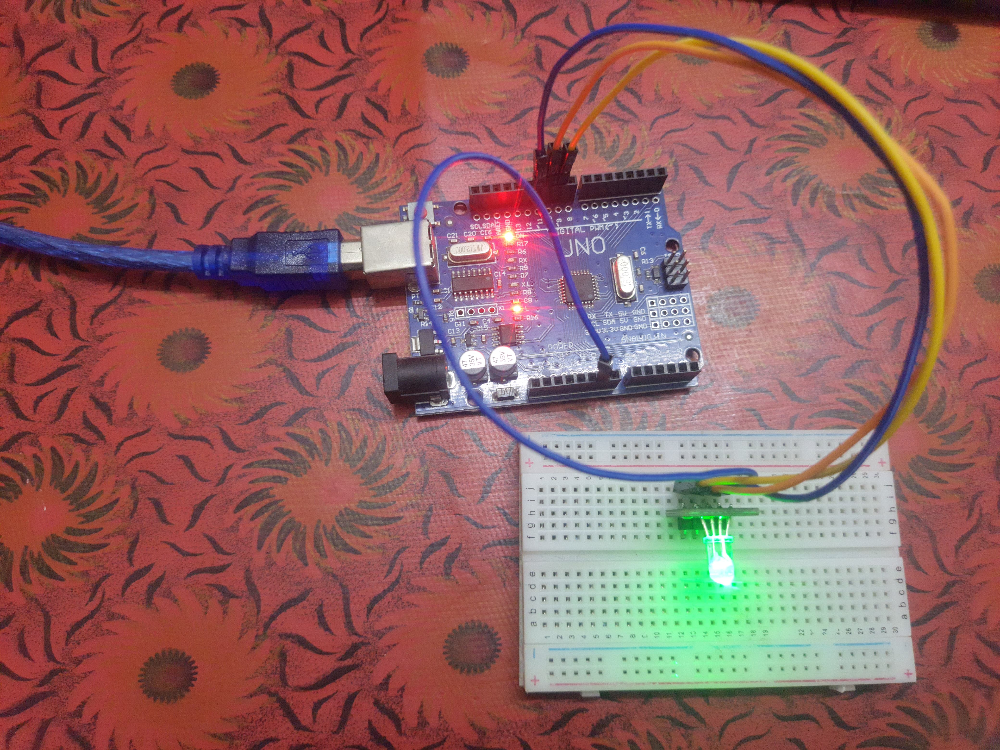

# 🌈 RGB Light Control - Color Cycling

## 📝 Overview
This Arduino project controls an RGB LED and cycles it through different colors — Red, Green, Blue, and White. It demonstrates how to control multiple pins with PWM (Pulse Width Modulation) to create color effects.

---

## 🧰 Components Used
- **Arduino UNO**
- **Common Cathode RGB LED**
- **Breadboard**
- **Jumper Wires**

---

## 🖼️ Image

---

### ⚙️ Wiring:
- Connect the **common cathode** (longest pin) of the RGB LED to **GND** on the Arduino.
- Connect:
  - **Red pin** of the RGB LED to **PWM pin 9** through a **220Ω resistor**.
  - **Green pin** of the RGB LED to **PWM pin 10** through a **220Ω resistor**.
  - **Blue pin** of the RGB LED to **PWM pin 11** through a **220Ω resistor**.

*(Resistors help limit the current and protect the LED.)*

---

## 🧑‍🔧 How It Works
- The RGB LED has three color pins (Red, Green, Blue) connected to PWM pins 9, 10, and 11 of Arduino UNO.
- The Arduino sets different analog (PWM) values on each pin to control the brightness of each color.
- By turning on Red, Green, and Blue individually and together, the LED displays Red, Green, Blue, and White colors in sequence.
- After each color, the LED stays on for 1 second, then switches to the next color.

---

## 🎥 Video Demonstration
Watch the demonstration of the RGB Light Control project on my [Google Drive video](https://drive.google.com/file/d/1OjxfuCdDEWiUM8quSlgDRX-URp2I9LQK/view?usp=sharing).
